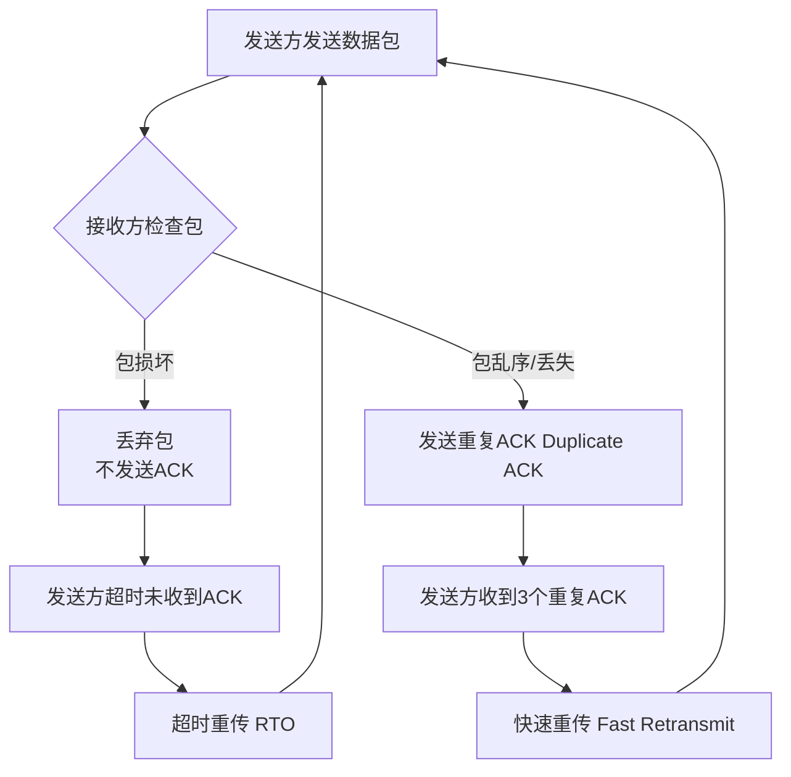

当TCP在中途发错了一个包（比如数据内容出错、顺序错乱、丢失等），**TCP会通过其内置的错误检测和重传机制来发现这个错误，并要求发送方重新传输这个包**，从而确保接收方最终能得到一个完整、正确、有序的数据流。

整个过程可以分解为以下几个关键步骤：

---

### 1. 错误检测：如何发现包错了？

TCP本身无法检测“数据内容”的错误（比如某个比特从0变成了1），这是由**校验和（Checksum）** 机制负责的。而对于顺序错乱或丢失，则由**序列号（Sequence Number）** 来发现。

*   **数据损坏（比特错误）**：
    *   发送方在发送前会计算整个TCP段（头部+数据）的校验和，并填入包头。
    *   接收方收到后，会**用同样的算法重新计算校验和**，并与包中的校验和进行比较。
    *   **如果两者不匹配**，接收方就确认为这个包在传输过程中**出错了**。

*   **包丢失或顺序错乱**：
    *   TCP为每个字节的数据都分配一个唯一的序列号（SEQ）。
    *   接收方根据序列号来确认**是否按顺序收到了所有数据**。
    *   例如，接收方期望收到序列号为 1001-2000 的数据包，但下一个收到的包序列号却是 3001-4000。这就说明 1001-2000 和 2001-3000 的包**可能丢失了**，或者 3001-4000 的包**不按顺序提前到达了**。

---

### 2. 接收方的反应：发现错误后怎么办？

接收方绝对不会接受这个出错或乱序的包，并且会立即向发送方报告情况。

*   **对于损坏的包**：接收方会**直接丢弃这个包**，不会回复任何确认（ACK）。
*   **对于乱序的包**：接收方会将它**暂时缓存起来**（因为后续的包可能会到达），但仍然只确认最后一个**按序到达**的字节。

---

### 3. 发送方的反应：如何重传错误的包？

发送方通过两种主要机制来触发重传：**超时重传（Retransmission Timeout, RTO）** 和**快速重传（Fast Retransmit）**。

#### 机制一：超时重传 (RTO)

这是最根本的重传机制。
1.  **定时器**：发送方每发送一个数据包，都会启动一个重传定时器。
2.  **等待ACK**：发送方等待接收方返回一个**确认号（ACK）**，表明“我已经成功收到直到X序号之前的所有数据”。
3.  **超时判定**：**如果在定时器到期后，还没有收到期望的ACK**，发送方就认为这个包要么**丢失**了，要么**损坏**被接收方丢弃了。
4.  **执行重传**：发送方会**重新发送**那个没有被确认的数据包，并重启定时器。

#### 机制二：快速重传 (Fast Retransmit)

这是为了更高效地处理丢包而设计的优化机制。
1.  **重复确认（Duplicate ACK）**：当接收方收到一个乱序的包（比如期望 SEQ=1001，却收到了 SEQ=2001），它不会确认新的数据，而是会**重复发送最后一个按序字节的ACK**。
    *   例如，它期望收到1001，却收到了2001，它会再次发送 `ACK=1001`。
2.  **触发条件**：当发送方**连续收到3个或以上相同的ACK**（例如连续收到3个 `ACK=1001`）时，它就会推断出 `SEQ=1001` 的这个包很可能丢失了，即使其重传定时器还没有到期。
3.  **立即重传**：发送方会**立刻重传**那个被认为丢失的包（`SEQ=1001`），而不必等待超时。这大大提高了效率。

---

### 总结与类比

**整个过程就像一个严谨的仓库管理员清点货物：**

1.  **你（发送方）** 要按顺序发货（包1，包2，包3...）。
2.  **管理员（接收方）** 按照顺序核对货物。他期望 next 收到箱包2。
3.  **发现错误**：
    *   **箱子损坏（包出错）**：他直接扔掉这个坏箱子，也不告诉你收到了（不发ACK）。
    *   **没收到包2，却收到了包3（包丢失/乱序）**：他会对你大喊：“我还是没收到包2啊！”（发送重复ACK）。
4.  **你的反应（重传）**：
    *   **等了一会儿**，一直没听到他说“包2收到”（**超时**），你就重新发一箱包2给他（**超时重传**）。
    *   或者你**连续听到他喊了三次**“我还是没收到包2啊！”，你立刻意识到包2可能丢了，马上补发一箱（**快速重传**）。

所以，TCP发错包后，**最终结果就是这个错误的包会被发送方重新传输一次，直到接收方正确接收为止**。对于应用程序来说，它根本感知不到底层这些复杂的重传过程，它得到的永远是一个完整、可靠的数据流。这就是TCP作为**可靠协议**的核心所在。
<!--stackedit_data:
eyJoaXN0b3J5IjpbLTE1MzI3ODQxMzEsODQ0MDA2MTY4LDE2MT
gxODAwNTJdfQ==
-->